# CESAR School · Pós DevOps · Kubernetes

Repositório com os laboratórios práticos do módulo de Orquestração de Containers com Kubernetes.


---

## Sumário

- [Como o Kubernetes funciona](#como-o-kubernetes-funciona)
- [Pré-requisitos](#pré-requisitos)
- [Preparando o cluster](#preparando-o-cluster)
- [Lab 1: Workloads + Acesso + Persistência](#lab-1-workloads--acesso--persistência)
  - [Objetos deste lab](#objetos-deste-lab)
  - [Estrutura dos manifests](#estrutura-dos-manifests)
  - [Como subir o ambiente](#como-subir-o-ambiente)
  - [Verificação](#verificação)
  - [Troubleshooting](#troubleshooting)
  - [Indo além (opcional)](#indo-além-opcional)
  - [Acesso via navegador](#acesso-via-navegador)
  - [Visão geral: como todos os recursos se conectam](#visão-geral-como-todos-os-recursos-se-conectam)
- [Lab 2: Resiliência e Disponibilidade](#lab-2-resiliência-e-disponibilidade)
  - [Objetos deste lab](#objetos-deste-lab-1)
  - [Pré-requisitos do Lab 2](#pré-requisitos-do-lab-2)
  - [Estrutura dos manifests](#estrutura-dos-manifests-1)
  - [Como subir o ambiente](#como-subir-o-ambiente-1)
  - [Verificação](#verificação-1)
  - [Troubleshooting](#troubleshooting-1)
  - [Indo além (opcional)](#indo-além-opcional-1)
  - [Acesso via navegador](#acesso-via-navegador-1)
  - [Visão geral: como todos os recursos se conectam](#visão-geral-como-todos-os-recursos-se-conectam-1)
- [Créditos](#créditos)

---

## Como o Kubernetes funciona

O Kubernetes é **declarativo**: descrevemos o *estado desejado* em manifests YAML.
O cluster trabalha continuamente para alcançá-lo.

Quem faz esse trabalho são os **controllers**, que operam num *reconciliation loop*.
Eles comparam o que existe com o que foi pedido e agem para convergir os dois.

O cluster se divide em **Control Plane** (decide o que deve acontecer)
e em **Worker Nodes** (onde os containers de fato rodam).

Vejamos o que acontece quando rodamos um `kubectl apply`:

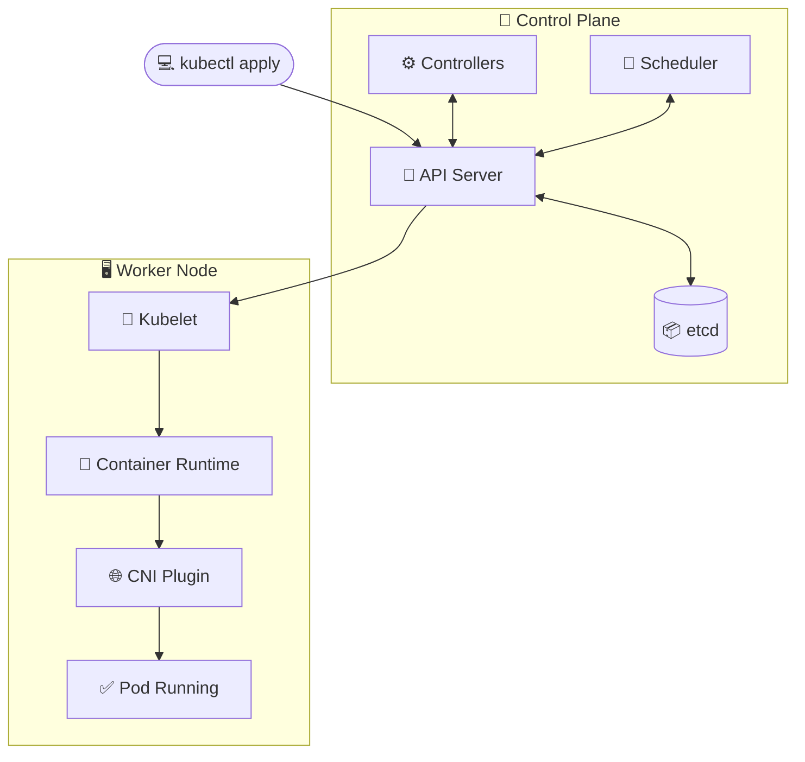

| Componente | Papel |
| --- | --- |
| 🔵 **API Server** | Porta de entrada: valida e processa todas as requisições |
| 📦 **etcd** | Banco que guarda o estado desejado do cluster |
| ⚙️ **Controllers** | Reconciliam Deployment, ReplicaSet e Pods |
| 📅 **Scheduler** | Escolhe o melhor nó para cada Pod |
| 🔧 **Kubelet** | Executa as instruções no nó escolhido |
| 🐳 **Container Runtime** | Puxa a imagem e inicia o container |
| 🌐 **CNI Plugin** | Atribui IP ao Pod e configura a rede |
| ✅ **Pod Running** | Pod pronto para receber tráfego |

> [!NOTE]
> **Reconciliation loop:** esse ciclo nunca para.
> Se um Pod cair, o controller percebe a diferença entre o estado atual e o desejado.
> Ele cria outro Pod para restaurá-lo, sem intervenção manual.

**Referências oficiais:**

- [Componentes do cluster: API Server, etcd, Scheduler e Kubelet][components]
- [Controllers / Reconciliation][controllers-reconciliation]
- [Pods][pods]

[components]: https://kubernetes.io/docs/concepts/overview/components/
[controllers-reconciliation]: https://kubernetes.io/docs/concepts/architecture/controller/
[pods]: https://kubernetes.io/docs/concepts/workloads/pods/

---

## Pré-requisitos

Ferramentas que precisam estar instaladas na máquina:

- [kind](https://kind.sigs.k8s.io/): sobe um cluster Kubernetes local dentro
  do Docker. Confira a instalação com `kind --version`.
- [kubectl](https://kubernetes.io/docs/tasks/tools/): o cliente de linha de
  comando do Kubernetes. Confira com `kubectl version --client`.
- [Docker](https://docs.docker.com/get-docker/): o runtime que o kind usa (e
  que também serve para construir imagens locais quando necessário).
  Confira com `docker --version`.

O cluster e o Ingress Controller são criados na seção
[Preparando o cluster](#preparando-o-cluster).

---

## Preparando o cluster

Subimos o ambiente uma única vez; ele serve para qualquer lab deste repositório.

A configuração do cluster fica em [`kind-config.yaml`](kind-config.yaml), que
expõe as portas 80/443 no host e marca o node com `ingress-ready=true`
(necessário para o Ingress responder em `http://localhost`).

```bash
# 1) Criar o cluster kind a partir do arquivo de configuração:
kind create cluster --name k8s-labs --config kind-config.yaml

# 2) Instalar o Ingress-NGINX Controller (provider: kind):
kubectl apply -f https://raw.githubusercontent.com/kubernetes/ingress-nginx/controller-v1.12.1/deploy/static/provider/kind/deploy.yaml

# 3) Aguardar o Ingress Controller ficar pronto (evita erro de webhook):
kubectl wait --namespace ingress-nginx \
  --for=condition=ready pod \
  --selector=app.kubernetes.io/component=controller \
  --timeout=90s

# 4) Instalar o metrics-server (não usado no Lab 1; necessário para HPA e kubectl top):
kubectl apply -f https://github.com/kubernetes-sigs/metrics-server/releases/latest/download/components.yaml

# 5) No kind o kubelet usa certificado auto-assinado; desabilita a verificação TLS
#    (só para ambiente de laboratório, nunca em produção):
kubectl patch deployment metrics-server -n kube-system --type='json' \
  -p='[{"op":"add","path":"/spec/template/spec/containers/0/args/-","value":"--kubelet-insecure-tls"}]'

# 6) Aguardar o metrics-server reiniciar (evita "Metrics API not available" no kubectl top):
kubectl rollout status deployment metrics-server -n kube-system --timeout=90s
```

---

## Lab 1: Workloads + Acesso + Persistência

Deploy completo do **TodoList** no cluster Kubernetes, cobrindo:
Namespace, ConfigMap, Secret, PVC, Deployment, Service, Ingress e CronJob.

### Objetos deste lab

Cada objeto do Kubernetes tem um papel específico.
Criaremos oito objetos, agrupados aqui por função:

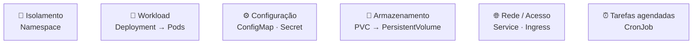

**Referências oficiais:**

- [Namespaces][namespaces]
- [Deployment][deployment]
- [ConfigMap][configmap]
- [Secret][secret]
- [PersistentVolume / PVC][pvc]
- [Service][service]
- [Ingress][ingress]
- [CronJob][cronjob]

[namespaces]: https://kubernetes.io/docs/concepts/overview/working-with-objects/namespaces/
[deployment]: https://kubernetes.io/docs/concepts/workloads/controllers/deployment/
[configmap]: https://kubernetes.io/docs/concepts/configuration/configmap/
[secret]: https://kubernetes.io/docs/concepts/configuration/secret/
[pvc]: https://kubernetes.io/docs/concepts/storage/persistent-volumes/
[service]: https://kubernetes.io/docs/concepts/services-networking/service/
[ingress]: https://kubernetes.io/docs/concepts/services-networking/ingress/
[cronjob]: https://kubernetes.io/docs/concepts/workloads/controllers/cron-jobs/

Nos passos a seguir, criaremos cada um desses objetos individualmente.
Ao final, há uma [visão geral](#visão-geral-como-todos-os-recursos-se-conectam)
de como todos se conectam em runtime.

### Estrutura dos manifests

```text
lab1/
├── namespace.yaml
├── configmap.yaml
├── secret.yaml
├── pvc.yaml
├── deployment.yaml
├── service.yaml
├── ingress.yaml
└── cronjob.yaml
```

### Como subir o ambiente

Siga os passos abaixo na ordem, porque cada um depende do anterior. Cada bloco
é colapsável: clique para expandir o objeto que quiser ver.

> [!TIP]
> **Comece com `--dry-run=client`:** em cada passo, o comando
> `kubectl create ... --dry-run=client -o yaml` **não cria nada no cluster**.
> Ele apenas imprime um YAML de exemplo. A ideia é redirecionar isso para um arquivo
> (`> lab1/arquivo.yaml`), ajustar o que faltar e só então criar o recurso com
> `kubectl apply -f`. Assim obtemos um esqueleto sem quebrar a regra do lab,
> já que a criação continua **declarativa**.
>
> O que o `dry-run` gera é o **mínimo que o Kubernetes exige**. O quanto
> precisaremos editar o arquivo gerado varia de acordo com o tipo de objeto:
>
> - 🟢 **Prontos para uso (requerem apenas revisão):** Namespace, ConfigMap,
>   Secret, Service e Ingress. O comando gera a estrutura praticamente finalizada.
> - 🟡 **Estrutura básica (requerem customização):** Deployment e CronJob. O
>   comando gera apenas o esqueleto inicial. Precisaremos adicionar os
>   complementos essenciais no YAML (ex: `envFrom`, volumes em `/data` e porta
>   `5000` no Deployment; comando `curl` e `secretKeyRef` no CronJob).
> - 🔴 **Criação manual (sem comando `create`):** PVC (PersistentVolumeClaim).
>   Como o `kubectl` não possui um gerador nativo para PVCs, o manifesto precisa
>   ser escrito integralmente do zero.

<details>
<summary><b>1. Namespace</b>: isola todos os recursos do lab</summary>

Todo manifest abaixo declara `namespace: todolist-grupo-05`.

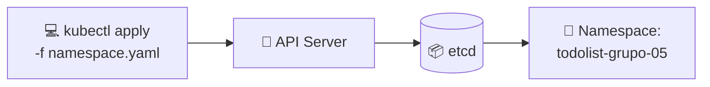

```bash
# Ponto de partida: gera o esqueleto do manifest
kubectl create namespace todolist-grupo-05 \
  --dry-run=client -o yaml > lab1/namespace.yaml

# Depois de revisar o arquivo, aplique:
kubectl apply -f lab1/namespace.yaml
```

</details>

<details>
<summary><b>2. ConfigMap</b>: variáveis não sensíveis (APP_NAME, APP_PORT, APP_COLOR)</summary>

Injeta as variáveis não sensíveis nos Pods via `envFrom`.

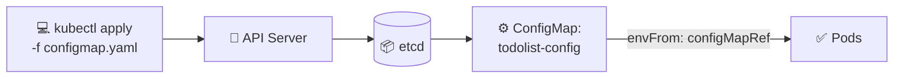

```bash
# Ponto de partida: gera o esqueleto já com as chaves do lab
kubectl create configmap todolist-config \
  --from-literal=APP_NAME="TodoList - Grupo 05" \
  --from-literal=APP_PORT=5000 \
  --from-literal=APP_COLOR=purple \
  -n todolist-grupo-05 --dry-run=client -o yaml > lab1/configmap.yaml

# Depois de revisar o arquivo, aplique:
kubectl apply -f lab1/configmap.yaml
```

</details>

<details>
<summary><b>3. Secret</b>: dados sensíveis (sessão, login, token)</summary>

Guarda `SESSION_KEY`, `ADMIN_USER`, `ADMIN_PASSWORD` e `CLEANUP_TOKEN`. É como o
ConfigMap, mas para dados sensíveis: valores em base64 (codificação, **não**
criptografia) e acesso restringível via RBAC.

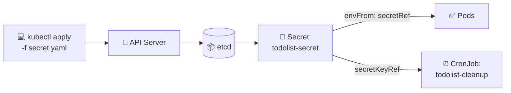

```bash
# Ponto de partida: o create já codifica os valores em base64 no arquivo
kubectl create secret generic todolist-secret \
  --from-literal=SESSION_KEY=troque-este-valor \
  --from-literal=ADMIN_USER=admin \
  --from-literal=ADMIN_PASSWORD=troque-esta-senha \
  --from-literal=CLEANUP_TOKEN=troque-este-token \
  -n todolist-grupo-05 --dry-run=client -o yaml > lab1/secret.yaml

# Depois de revisar o arquivo, aplique:
kubectl apply -f lab1/secret.yaml
```

</details>

<details>
<summary><b>4. PersistentVolumeClaim</b>: volume de 500Mi para o banco</summary>

Solicita um volume de `500Mi` (`ReadWriteOnce`); o Kubernetes provisiona o
PersistentVolume e o Deployment o monta em `/data` (banco `todos.db`).

> **Nota:** no kind, o PVC só fica `Bound` quando um Pod o monta (passo 5); até lá
> aparece como `Pending`, o que é normal. Veja [Troubleshooting](#troubleshooting).

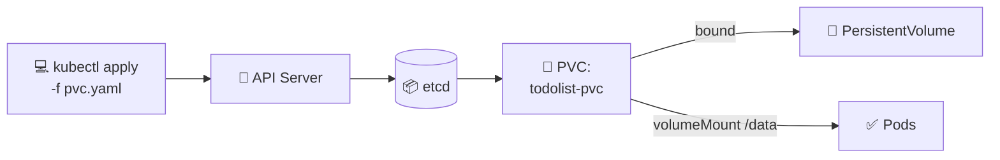

> **Importante:** não há `kubectl create pvc`; escreva `lab1/pvc.yaml` à mão com
> `kind: PersistentVolumeClaim`, `accessModes: [ReadWriteOnce]` e
> `resources.requests.storage: 500Mi`.

```bash
kubectl apply -f lab1/pvc.yaml
```

</details>

<details>
<summary><b>5. Deployment</b>: 2 réplicas do servidor TodoList</summary>

Mantém **2 réplicas** de `andreffcastro/k8s-todolist:1.0.0` sempre rodando. Cada
réplica consome o ConfigMap e o Secret via `envFrom` e monta o PVC em `/data`.

> **Imutabilidade de variáveis injetadas:** valores de `envFrom` são lidos
> só na inicialização do container. Para aplicar mudanças no ConfigMap/Secret,
> recrie os Pods: `kubectl rollout restart deployment/todolist -n todolist-grupo-05`.

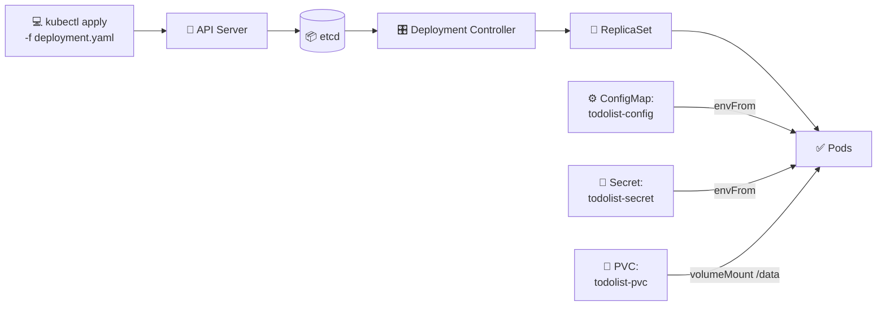

```bash
# Ponto de partida: gera só o esqueleto (imagem + réplicas)
kubectl create deployment todolist \
  --image=andreffcastro/k8s-todolist:1.0.0 --replicas=2 \
  -n todolist-grupo-05 --dry-run=client -o yaml > lab1/deployment.yaml

# Edite o arquivo para adicionar: envFrom (ConfigMap + Secret),
# containerPort 5000, volumeMounts em /data e o volume apontando para o PVC.
# Depois aplique:
kubectl apply -f lab1/deployment.yaml
```

</details>

<details>
<summary><b>6. Service</b>: expõe os Pods na porta 80 → 5000</summary>

Expõe os Pods via `ClusterIP` na porta `80 → 5000`; o `selector: app: todolist`
balanceia entre as réplicas.

> **Service vs Ingress:** o Service dá um endereço interno e estável aos Pods
> (`ClusterIP`, só acessível dentro do cluster); quem expõe ao navegador é o
> Ingress (passo 7). No mapeamento de portas, `port: 80` é a porta do Service e
> `targetPort: 5000` é onde a aplicação escuta no Pod.

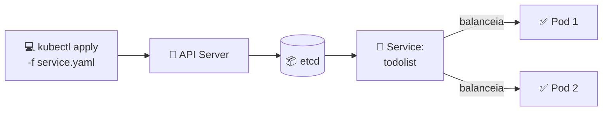

```bash
# Ponto de partida: --tcp=80:5000 já define port 80 → targetPort 5000
kubectl create service clusterip todolist --tcp=80:5000 \
  -n todolist-grupo-05 --dry-run=client -o yaml > lab1/service.yaml

# Confira o selector (deve ser app: todolist) e aplique:
kubectl apply -f lab1/service.yaml
```

</details>

<details>
<summary><b>7. Ingress</b>: acesso externo via todolist-grupo-05.local</summary>

Recebe requisições em `todolist-grupo-05.local` e roteia para o Service. Requer o
Ingress-NGINX Controller instalado.

> **Importante:** sem `ingressClassName: nginx`, o Controller ignora o
> manifesto (no kind não há classe default). O roteamento é por **host**: a regra
> só responde a `todolist-grupo-05.local`; outros endereços (como `localhost`)
> retornam `404 Not Found`.

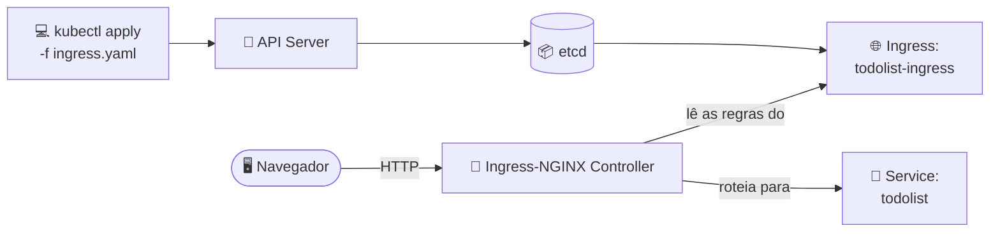

```bash
# Ponto de partida: --rule="host/path=service:port"
kubectl create ingress todolist-ingress \
  --rule="todolist-grupo-05.local/*=todolist:80" \
  -n todolist-grupo-05 --dry-run=client -o yaml > lab1/ingress.yaml

# Depois de revisar o arquivo, aplique:
kubectl apply -f lab1/ingress.yaml
```

</details>

<details>
<summary><b>8. CronJob</b>: limpeza automática a cada 5 minutos</summary>

A cada 5 minutos (`*/5 * * * *`), um Job com `curlimages/curl:8.21.0` faz
`POST /cleanup` para limpar itens concluídos. O token vem do Secret.

> **Três cuidados importantes no CronJob:**
>
> - **Expansão de variáveis:** `$CLEANUP_TOKEN` só expande dentro de um shell;
>   use `command: ["/bin/sh", "-c", "..."]`. Sem o `/bin/sh -c`, o header vai
>   literal e causa `401/403`.
> - **`restartPolicy`:** Jobs/CronJobs exigem `OnFailure` ou `Never`; o padrão
>   `Always` falha ao aplicar.
> - **Escopo das labels:** mantenha `app`/`component` só no CronJob, não no Pod
>   que ele cria. Com `app: todolist` no Pod, o Service rotearia tráfego para uma
>   tarefa que só executa e encerra.

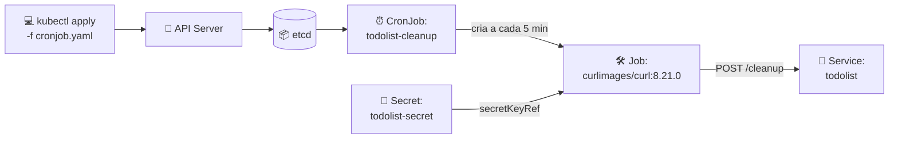

```bash
# Ponto de partida: gera o esqueleto com imagem + agendamento
kubectl create cronjob todolist-cleanup \
  --image=curlimages/curl:8.21.0 --schedule="*/5 * * * *" \
  -n todolist-grupo-05 --dry-run=client -o yaml > lab1/cronjob.yaml

# Edite o arquivo para adicionar o command do curl (POST /cleanup) e o
# CLEANUP_TOKEN via secretKeyRef. Depois aplique:
kubectl apply -f lab1/cronjob.yaml
```

</details>

### Verificação

```bash
# ver visão geral dos recursos
kubectl get all -n todolist-grupo-05

# verificar PVCs, Ingress e CronJobs
kubectl get pvc,ingress,cronjob -n todolist-grupo-05

# verificar pods com mais detalhes
kubectl get pods -n todolist-grupo-05 -o wide
kubectl describe pod <POD_NAME> -n todolist-grupo-05

# logs dos pods (por label)
kubectl logs -l app=todolist -n todolist-grupo-05

# caso precise inspecionar o serviço localmente (5000 local -> 80 do Service):
kubectl port-forward svc/todolist 5000:80 -n todolist-grupo-05
```

### Troubleshooting

Problemas comuns e soluções ao executar o ambiente localmente com o `kind`:

- 🔴 **Erro de porta alocada (`port is already allocated`):**
  - **Causa:** outro serviço no host (como IIS no Windows, Apache, ou outro
    cluster kind) já está utilizando a porta 80 ou 443.
  - **Solução:** libere as portas parando o serviço conflitante, ou altere o
    parâmetro `hostPort` no arquivo [`kind-config.yaml`](kind-config.yaml) para
    portas altas (ex: `8080` e `8443`). Lembre-se de recriar o cluster e acessar
    a aplicação via `http://localhost:8080`.

- 🟡 **Volume preso no status `Pending` (PVC):**
  - **Causa:** comportamento esperado. A `StorageClass` padrão do kind utiliza o
    modo `WaitForFirstConsumer`.
  - **Solução:** nenhuma ação é necessária. O volume só será provisionado
    fisicamente quando o primeiro Pod tentar montá-lo. Assim que o Deployment
    subir, o status do PVC mudará automaticamente para `Bound`.

- 🔴 **Falha ao baixar imagem (`ImagePullBackOff`):**
  - **Causa 1 (Imagem Pública):** falha de conexão com a internet ou
    instabilidade no Docker Hub ao tentar baixar `andreffcastro/k8s-todolist:1.0.0`.
  - **Causa 2 (Imagem Local):** o cluster kind funciona isolado do sistema e
    não enxerga o *registry* local do Docker por padrão.
  - **Solução para imagens locais:** é necessário carregar a imagem construída
    manualmente para dentro do node do kind antes de aplicá-la:

    ```bash
    # Constrói a imagem localmente
    docker build -t minha-imagem:tag .

    # Injeta a imagem diretamente no cluster kind
    kind load docker-image minha-imagem:tag --name k8s-labs
    ```

### Indo além (opcional)

Tópicos fora do escopo deste lab, mas úteis quando for para um ambiente real:

- **Secrets seguros:** o Secret deste lab está versionado só para fins
  didáticos. Em projetos reais, **não versione valores sensíveis no repositório**
  (base64 é codificação, não criptografia). Crie o Secret fora do Git:

  ```bash
  kubectl create secret generic todolist-secret \
    --from-literal=ADMIN_USER=admin \
    --from-literal=ADMIN_PASSWORD='sua-senha' \
    --from-literal=SESSION_KEY='algum-valor' \
    --from-literal=CLEANUP_TOKEN='algum-token' -n todolist-grupo-05
  ```

  Para gerenciar segredos versionáveis de forma segura, veja
  [SealedSecrets](https://github.com/bitnami-labs/sealed-secrets) ou
  [External Secrets](https://external-secrets.io/).

- **TLS no Ingress:** o lab usa HTTP simples. Para HTTPS local, use
  [`mkcert`](https://github.com/FiloSottile/mkcert) + um Secret TLS, ou
  [cert-manager](https://cert-manager.io/) com um issuer. (Let's Encrypt não
  emite certificado para `localhost`.)

- **Alternativas ao `/etc/hosts`:**
  - `kubectl port-forward svc/todolist 5000:80 -n todolist-grupo-05`
    (acessa em `http://localhost:5000`, sem Ingress)
  - [`nip.io`](https://nip.io): use um host como
    `todolist-grupo-05.127.0.0.1.nip.io`, que resolve para `127.0.0.1`
    sem editar arquivo nenhum.

### Acesso via navegador

Vamos adicionar a entrada abaixo ao `/etc/hosts`:

```text
127.0.0.1 todolist-grupo-05.local
```

A aplicação fica acessível em: [http://todolist-grupo-05.local](http://todolist-grupo-05.local)

> [!WARNING]
> **No WSL:** ao abrir o site no navegador do **Windows**, o sistema prioriza o
> arquivo hosts do Windows (`C:\Windows\System32\drivers\etc\hosts`), e não o `/etc/hosts`
> do WSL. O hosts do Windows é um arquivo comum e persiste normalmente. Já o
> `/etc/hosts` *de dentro do WSL* é regenerado a cada boot (apagando edições
> manuais), a menos que isso seja desativado com `generateHosts = false` no
> `/etc/wsl.conf`. Para evitar essa confusão, use o `nip.io`
> (`http://todolist-grupo-05.127.0.0.1.nip.io`), que resolve sozinho sem editar
> arquivo nenhum.

### Visão geral: como todos os recursos se conectam

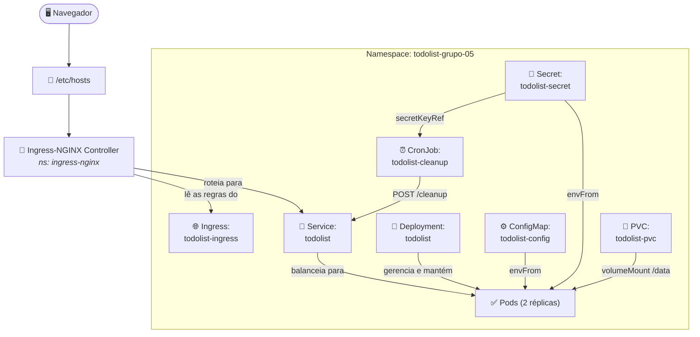

---

## Lab 2: Resiliência e Disponibilidade

Evolui o Deployment do Lab 1 para uma aplicação mais robusta: adiciona
**observabilidade de saúde** (probes), **autoscaling** (HPA), **resiliência**
(PDB) e **controle de acesso** (RBAC).

A versão 2 do TodoList (imagem `andreffcastro/k8s-todolist:1.1.0`) traz uma tela de
**Pods** (mostra em tempo real quais instâncias estão rodando) e uma tela de
**Cleanup History** (logs dos jobs de limpeza). Para essas telas funcionarem, a
aplicação precisa consultar a API do Kubernetes. É para isso que entram o
ServiceAccount + Role + RoleBinding.

### Objetos deste lab

Além dos objetos do Lab 1 (que continuam valendo), o Lab 2 **cria** cinco recursos
novos e **modifica** o Deployment:

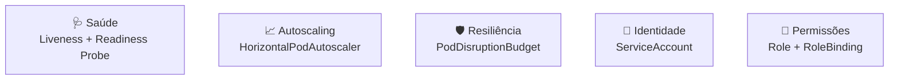

| Objeto | Papel |
| --- | --- |
| 🩺 **Liveness Probe** | Detecta quando o container trava e o reinicia automaticamente |
| 🩺 **Readiness Probe** | Indica quando o Pod está pronto para receber tráfego |
| 📈 **HPA** | Ajusta automaticamente o número de réplicas conforme a carga |
| 🛡️ **PDB** | Garante um número mínimo de Pods disponíveis durante interrupções voluntárias |
| 🪪 **ServiceAccount** | Identidade que o Pod usa para se autenticar na API do Kubernetes |
| 🔑 **Role + RoleBinding** | Define e concede permissões de acesso a recursos do namespace |

**Referências oficiais:**

- [Liveness, Readiness e Startup Probes][probes]
- [HorizontalPodAutoscaler][hpa]
- [PodDisruptionBudget][pdb-ref]
- [ServiceAccount][sa]
- [RBAC: Role e RoleBinding][rbac]

[probes]: https://kubernetes.io/docs/tasks/configure-pod-container/configure-liveness-readiness-startup-probes/
[hpa]: https://kubernetes.io/docs/tasks/run-application/horizontal-pod-autoscale/
[pdb-ref]: https://kubernetes.io/docs/concepts/workloads/pods/disruptions/
[sa]: https://kubernetes.io/docs/concepts/security/service-accounts/
[rbac]: https://kubernetes.io/docs/reference/access-authn-authz/rbac/

### Pré-requisitos do Lab 2

1. **Cluster + Ingress + metrics-server** já preparados conforme
   [Preparando o cluster](#preparando-o-cluster). O **metrics-server é
   obrigatório** aqui: sem ele o HPA fica com `<unknown>` em `TARGETS` e não escala.
2. **Recursos base do Lab 1 aplicados:** o Lab 2 reaproveita o `Namespace`,
   `ConfigMap`, `Secret`, `PVC`, `Service`, `Ingress` e o `CronJob` (este último
   gera os jobs de limpeza que alimentam a tela **Cleanup History** da V2). Se
   ainda não subiu o Lab 1, aplique-os antes:

   ```bash
   kubectl apply -f lab1/namespace.yaml
   kubectl apply -f lab1/configmap.yaml
   kubectl apply -f lab1/secret.yaml
   kubectl apply -f lab1/pvc.yaml
   kubectl apply -f lab1/service.yaml
   kubectl apply -f lab1/ingress.yaml
   kubectl apply -f lab1/cronjob.yaml
   ```

   > 📝 **Nota:** o `lab2/deployment.yaml` **substitui** o do Lab 1 (imagem
   > `1.1.0`, probes e `serviceAccountName`). Não aplique o
   > `lab1/deployment.yaml`.

### Estrutura dos manifests

```text
lab2/
├── serviceaccount.yaml
├── role.yaml
├── rolebinding.yaml
├── deployment.yaml
├── hpa.yaml
└── pdb.yaml
```

### Como subir o ambiente

Siga na ordem, porque cada passo depende do anterior. O ServiceAccount, a Role e o
RoleBinding vêm **antes** do Deployment, porque o Pod já sobe apontando para o SA
e usando as permissões concedidas. O HPA e o PDB vêm **depois** do Deployment,
pois referenciam o workload que já precisa existir.

> [!TIP]
> **Comece com `--dry-run=client`:** em cada passo, o comando
> `kubectl create ... --dry-run=client -o yaml` **não cria nada no cluster**.
> Apenas imprime um YAML de esqueleto. Redirecione para o arquivo
> (`> lab2/arquivo.yaml`), ajuste o que faltar e só então crie o recurso com
> `kubectl apply -f`. Assim a criação continua **declarativa**.
>
> O quanto precisaremos editar o arquivo gerado varia de acordo com o tipo de
> objeto:
>
> - 🟢 **Prontos para uso (requerem apenas revisão):** ServiceAccount e
>   RoleBinding. O comando gera a estrutura praticamente finalizada.
> - 🟡 **Estrutura básica (requerem customização):** Role (falta a segunda
>   regra, `get` em `pods/log`) e HPA (o comando gera a API `v1`; migramos
>   para `autoscaling/v2` para habilitar o `behavior`).
> - 🔴 **Criação manual (sem comando `create`):** PodDisruptionBudget. Como o
>   `kubectl` não possui um gerador nativo para PDBs, o manifesto precisa ser
>   escrito integralmente do zero.
> - 🔵 **Caso especial:** o Deployment não nasce de um `dry-run` novo. É o
>   `lab1/deployment.yaml` editado com a imagem `1.1.0`, `serviceAccountName`
>   e as probes.

<details>
<summary><b>1. ServiceAccount</b>: identidade do Pod perante a API</summary>

Cria a identidade `todolist-serviceaccount`, referenciada pelo Deployment (passo 4)
e alvo do RoleBinding (passo 3). Sem SA explícito, o Pod usaria o `default` do
namespace.

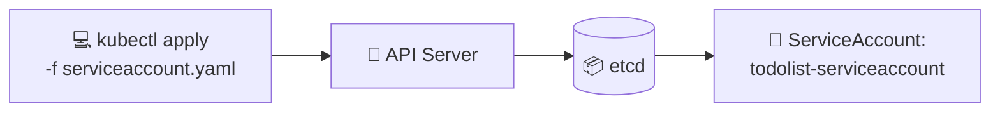

```bash
# Ponto de partida: gera o esqueleto do manifest
kubectl create serviceaccount todolist-serviceaccount \
  -n todolist-grupo-05 --dry-run=client -o yaml > lab2/serviceaccount.yaml

# Depois de revisar o arquivo, aplique:
kubectl apply -f lab2/serviceaccount.yaml
```

</details>

<details>
<summary><b>2. Role</b>: o que pode ser lido (pods e logs)</summary>

Define, no namespace, as ações permitidas: `get`/`list` em `pods` e `get` em
`pods/log`, o que alimenta as telas de **Pods** e **Cleanup History**. Sozinha
não concede nada; quem vincula é o RoleBinding (passo 3).

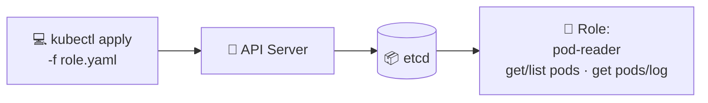

```bash
# Ponto de partida: gera a regra de get/list em pods
kubectl create role pod-reader \
  --verb=get,list --resource=pods \
  -n todolist-grupo-05 --dry-run=client -o yaml > lab2/role.yaml

# Edite o arquivo para adicionar a segunda regra: get em pods/log
# (subrecurso 'pods/log' com verbo 'get'). Depois aplique:
kubectl apply -f lab2/role.yaml
```

</details>

<details>
<summary><b>3. RoleBinding</b>: concede a Role ao ServiceAccount</summary>

Vincula a Role `pod-reader` ao ServiceAccount `todolist-serviceaccount`. É aqui
que as permissões passam a valer: qualquer Pod com esse SA pode ler pods e logs no
namespace.

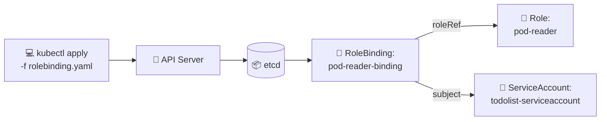

```bash
# Ponto de partida: já liga a Role ao SA no formato correto
kubectl create rolebinding pod-reader-binding \
  --role=pod-reader \
  --serviceaccount=todolist-grupo-05:todolist-serviceaccount \
  -n todolist-grupo-05 --dry-run=client -o yaml > lab2/rolebinding.yaml

# Depois de revisar o arquivo, aplique:
kubectl apply -f lab2/rolebinding.yaml
```

</details>

<details>
<summary><b>4. Deployment</b>: Lab 1 + probes + SA</summary>

O Deployment do Lab 1 evoluído. As mudanças em relação ao Lab 1:

- **Imagem** atualizada para `andreffcastro/k8s-todolist:1.1.0` (expõe `GET /healthz`).
- **`serviceAccountName: todolist-serviceaccount`** para o Pod usar a identidade do passo 1.
- **Liveness Probe:** `httpGet /healthz:5000`, `initialDelaySeconds: 10`,
  `periodSeconds: 10`. Se o container travar, o kubelet o reinicia.
- **Readiness Probe:** `httpGet /healthz:5000`, `initialDelaySeconds: 5`,
  `periodSeconds: 10`. O Service só roteia tráfego quando o Pod passa na probe.

> **Nota:** *liveness* e *readiness* cumprem papéis diferentes. A *liveness* reinicia o container se ele travar, enquanto a *readiness* tira o Pod do balanceamento enquanto ele ainda não está pronto.

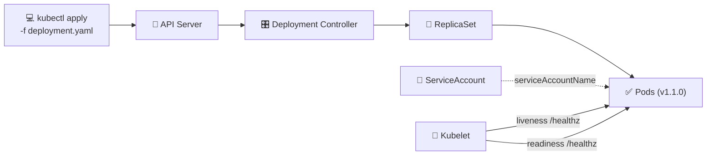

```bash
# O deployment.yaml do Lab 2 é uma versão do Lab 1 adaptada. Parta do arquivo existente
# (lab1/deployment.yaml) e adicione: imagem 1.1.0, serviceAccountName,
# livenessProbe e readinessProbe. O resources.requests.cpu já vem do Lab 1,
# e é ele que o HPA usa como base de cálculo. Depois aplique:
kubectl apply -f lab2/deployment.yaml
```

</details>

<details>
<summary><b>5. HorizontalPodAutoscaler</b>: escala de 1 a 4 por CPU</summary>

Observa a CPU dos Pods (via metrics-server) e ajusta as réplicas entre `1` e `4`,
mirando **50%** de uso médio. O cálculo é relativo ao `requests.cpu` do Deployment.

> **Nota:** `averageUtilization` no `autoscaling/v2` é o equivalente moderno de
> `targetCPUUtilizationPercentage: 50` na API `v1`. A `v2` também habilita as
> políticas de `behavior` do arquivo.

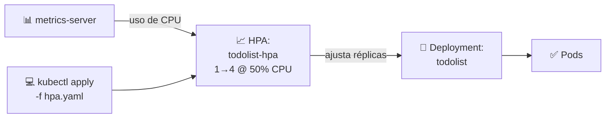

```bash
# Ponto de partida: gera o HPA com min/max e alvo de CPU
kubectl autoscale deployment todolist \
  --min=1 --max=4 --cpu-percent=50 \
  -n todolist-grupo-05 --dry-run=client -o yaml > lab2/hpa.yaml

# (Opcional) migre para apiVersion autoscaling/v2 e ajuste o behavior.
# Depois aplique:
kubectl apply -f lab2/hpa.yaml
```

</details>

<details>
<summary><b>6. PodDisruptionBudget</b>: mantém ≥1 Pod disponível</summary>

Protege a app em **interrupções voluntárias** (drain, upgrade): com
`minAvailable: 1`, o cluster nunca remove o último Pod saudável. O
`selector: app: todolist` precisa casar com os Pods do Deployment.

> **Nota:** o PDB atua apenas em disrupções voluntárias, como `kubectl drain`, e não
> em falhas involuntárias, como crash ou OOM. Nesses casos, réplicas e probes são
> a defesa principal.

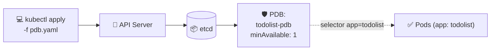

> **Importante:** não há `kubectl create pdb`; escreva `lab2/pdb.yaml` à mão com
> `kind: PodDisruptionBudget`, `spec.minAvailable: 1` e
> `spec.selector.matchLabels.app: todolist`.

```bash
kubectl apply -f lab2/pdb.yaml
```

</details>

### Verificação

```bash
# Visão geral dos recursos do lab
kubectl get deployment,hpa,pdb,sa,role,rolebinding -n todolist-grupo-05

# Acompanhar os Pods ficarem Ready (probes passando)
kubectl get pods -n todolist-grupo-05 -w

# Estado das probes / eventos do Pod
kubectl describe pod <POD_NAME> -n todolist-grupo-05

# HPA deve mostrar TARGETS com um valor de CPU (não <unknown>)
kubectl get hpa todolist-hpa -n todolist-grupo-05
```

Confirmar as permissões RBAC do ServiceAccount:

```bash
# Deve responder: yes
kubectl auth can-i get pods \
  --as=system:serviceaccount:todolist-grupo-05:todolist-serviceaccount \
  -n todolist-grupo-05

# Deve responder: no (só concedemos leitura, não delete)
kubectl auth can-i delete pods \
  --as=system:serviceaccount:todolist-grupo-05:todolist-serviceaccount \
  -n todolist-grupo-05
```

### Troubleshooting

Problemas específicos deste lab:

- 🟡 **HPA com `<unknown>` em `TARGETS`:**
  - **Causa:** o metrics-server não está pronto ou o Deployment não tem
    `resources.requests.cpu` (o HPA calcula o uso relativo a ele).
  - **Solução:** confirme o metrics-server com
    `kubectl top pods -n todolist-grupo-05` e o `requests.cpu` no Deployment. Veja
    [Preparando o cluster](#preparando-o-cluster).

- 🔴 **Pod não fica `Ready` ou reinicia em loop (probes):**
  - **Causa:** a probe HTTP em `/healthz:5000` está falhando: a app ainda pode
    estar subindo, a porta pode estar errada, ou o `initialDelaySeconds` está
    curto demais para o boot.
  - **Solução:** rode `kubectl describe pod <POD_NAME> -n todolist-grupo-05` e veja
    os eventos das probes. A *readiness* mantém o Pod fora do Service; a *liveness*
    reinicia o container. Aumente o `initialDelaySeconds` se o boot for lento.

- 🔴 **`kubectl auth can-i get pods` responde `no`:**
  - **Causa:** a Role/RoleBinding não está vinculada ao ServiceAccount correto
    (nome do SA, namespace ou `roleRef` divergentes).
  - **Solução:** confira que o RoleBinding aponta para a Role `pod-reader` e o
    `todolist-serviceaccount`, e que o Deployment usa `serviceAccountName`. As telas
    **Pods** e **Cleanup History** dependem disso.

### Indo além (opcional)

Tópicos fora do escopo deste lab, mas úteis quando for para um ambiente real:

- **Role vs ClusterRole:** a Role deste lab só vale no namespace
  `todolist-grupo-05`. Para conceder acesso em todos os namespaces (comum em
  operadores e controllers), use
  [ClusterRole](https://kubernetes.io/docs/reference/access-authn-authz/rbac/#role-and-clusterrole)
  e `ClusterRoleBinding` em vez de Role e RoleBinding.

- **HPA por métricas customizadas:** este lab escala por CPU, a métrica mais
  simples, disponível via metrics-server. Em produção é comum escalar por
  métricas de aplicação (fila de mensagens, requisições por segundo) com o
  [Prometheus Adapter](https://github.com/kubernetes-sigs/prometheus-adapter)
  ou o [KEDA](https://keda.sh/).

- **PDB por percentual:** este lab usa `minAvailable: 1` (número absoluto).
  Para Deployments com muitas réplicas, `minAvailable: 50%` ou
  `maxUnavailable: 1` costumam acompanhar melhor o tamanho do workload.

### Acesso via navegador

O acesso é o mesmo do Lab 1: o `Service` e o `Ingress` são reaproveitados. Se a
entrada ainda não foi adicionada ao `/etc/hosts`, veja
[Acesso via navegador](#acesso-via-navegador) do Lab 1:

```text
127.0.0.1 todolist-grupo-05.local
```

A aplicação fica em [http://todolist-grupo-05.local](http://todolist-grupo-05.local).
Na V2, confira as novas telas **Pods** (instâncias rodando em tempo real) e
**Cleanup History** (logs dos jobs de limpeza), que dependem do RBAC configurado
neste lab.

### Visão geral: como todos os recursos se conectam

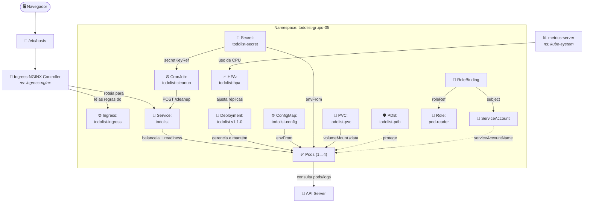

> [!NOTE]
> **Por que o API Server aparece aqui e não no Lab 1:** no Lab 2 a aplicação passa
> a **consultar a própria API do Kubernetes** para exibir as telas de *Pods* e
> *Cleanup History*. Essa é a única interação nova com o plano de controle, e ela é
> habilitada pelo `ServiceAccount` (identidade) e pelo `Role` + `RoleBinding`
> (permissão de `get`/`list` em pods e `get` em `pods/log`). No Lab 1, a aplicação
> só servia HTTP, por isso ele não aparecia no diagrama.

---

## Créditos

Disciplina ministrada pelo professor [@andreffcastro](https://github.com/andreffcastro).
Ele também é autor da imagem [`andreffcastro/k8s-todolist`](https://hub.docker.com/r/andreffcastro/k8s-todolist)
utilizada neste lab.
